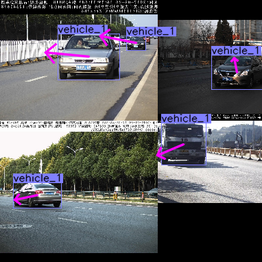
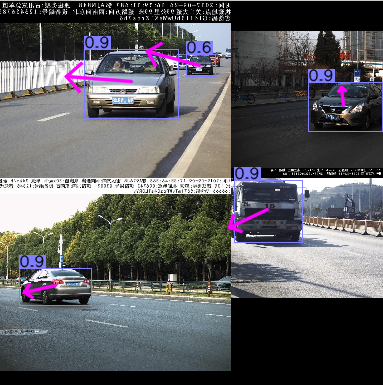
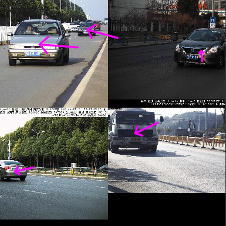

# CenterTrack training for 2D object tracking

## 根据[**CenterTrack官方pytorch版本**](https://github.com/xingyizhou/CenterTrack) 改写.感谢作者开源了这么棒的工作
> 添加了mosaic数据增强,增加训练集小目标数量,提高检测背景复杂度;  
> 主干网络替换成了resnet18,方便在海思嵌入式板子上部署;  
> 添加了CIoU Loss,目标框的更准,对小目标提升明显;  
> 将L1 Loss替换成smooth L1 Loss,使模型更好的收敛,具体效果未做对比.  
> 色域变换的代码屏蔽掉了,因为我的cpu太差,色域变换太耗时,你可以打开它试试,在generic_dataset.py中

## 这个仓库的代码真不讲究
目前只是调通了2D目标检测跟踪训练的代码,因为海思板子上cpu资源不足,pre_hm也舍弃了(其实效果影响很小),其他我项目用不到的代码等以后再调吧.

~~~
tracking --exp_id res_18 --dataset custom --custom_dataset_ann_path /your/train/ann/path.json --custom_dataset_img_path /your/train/images/path --num_classes 1 --input_h 320 --input_w 320 --same_aug --batch_size 32 --load_model /if/you/have/pre_train.pth
~~~
加上 
~~~
--debug 1
~~~
可以查看验证数据增强的效果,其中箭头是从当前帧目标的中心点指向上一帧对应目标的中心点:  

   
img_gt和pre_img_gt,验证数据标签,查看数据增强效果  
   
   
   
img_pred和pre_img_pred, 查看当前模型在训练集上的检测跟踪效果